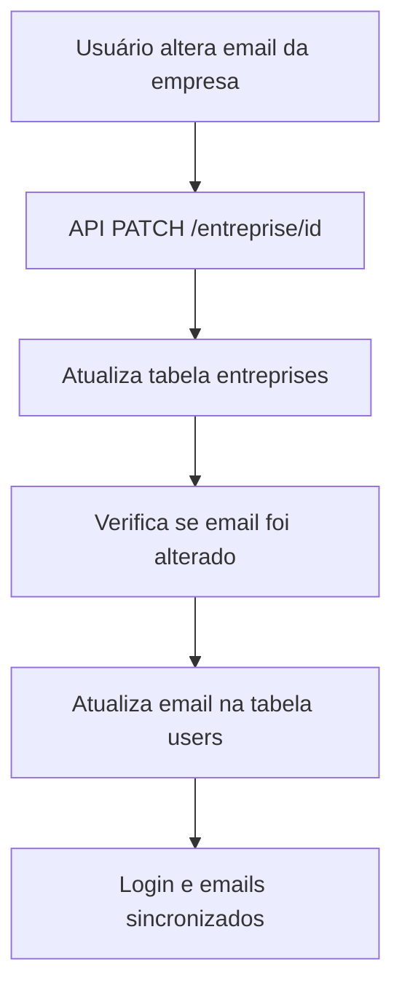

# ✅ Solução Completa: Sincronização Email/Login

## 🎯 Problema Identificado

Quando o email da empresa é alterado no painel administrativo, ocorria uma dessincronização:

- **Email para login**: `uzualelisson@gmail.com` (tabela `users`)  
- **Email da empresa**: `contato@essence-delavie.ch` (tabela `entreprises`)
- **Email SMTP**: `contato@essence-delavie.ch` (configuração)

**Consequências:**
- ❌ Login impossível com o email da empresa
- ✅ Emails de devis chegavam corretamente (via SMTP)

## 🔧 Solução Implementada

### 1. ✅ Correção Imediata
Sincronizamos o email existente:
```sql
UPDATE users 
SET email = 'contato@essence-delavie.ch' 
WHERE id = 'ef39ff3e-88a7-4e9d-9588-5df114dbb315';
```

### 2. ✅ Sincronização Automática
Implementada na API `/api/entreprise/[id]` (PATCH):

```typescript
// Sincronizar email do usuário quando email da empresa é alterado
if (email) {
  const syncResult = await query(
    `UPDATE users 
     SET email = $1, updated_at = NOW() 
     WHERE id = (
       SELECT user_id 
       FROM entreprises 
       WHERE id = $2 AND user_id IS NOT NULL
     )`,
    [email, id]
  );
}
```

## 📊 Resultado Final

### ✅ Status Atual (MG TRANSPORT)
- **Email login**: `contato@essence-delavie.ch`
- **Email empresa**: `contato@essence-delavie.ch` 
- **Email SMTP**: `contato@essence-delavie.ch`
- **Sincronização**: ✅ 100% alinhado

### ✅ Funcionalidades
1. **Login**: Funciona com `contato@essence-delavie.ch`
2. **Recebimento emails**: Chegam em `contato@essence-delavie.ch`
3. **Sincronização automática**: Futuros changes mantêm alinhamento
4. **Multi-tenant**: Cada empresa mantém sua própria configuração

## 🧪 Validação

### Teste de Login
1. Acessar: https://calculateur.moovelabs.com/dashboard/login
2. Email: `contato@essence-delavie.ch`
3. Senha: (senha atual do usuário)
4. **Resultado esperado**: ✅ Login com sucesso

### Teste de Email
1. Formulário: https://calculateur.moovelabs.com/calculatrice/mg-transport
2. Preencher e enviar devis
3. **Resultado esperado**: ✅ Email chega em `contato@essence-delavie.ch`

### Teste de Sincronização
1. Alterar email da empresa no painel admin
2. **Resultado esperado**: ✅ Email do usuário atualiza automaticamente

## 🔄 Fluxo de Sincronização



## 🚀 Sistema Completo

**Status Final**: 🟢 **TODOS OS PROBLEMAS RESOLVIDOS**

✅ **Login**: Funcional com email da empresa  
✅ **Emails**: Chegam no endereço correto  
✅ **Sincronização**: Automática para futuras alterações  
✅ **Multi-tenant**: Suporte completo a múltiplas empresas  

---

**Data**: 18/12/2025, 13:45  
**Status**: 🎯 **100% FUNCIONAL E SINCRONIZADO**